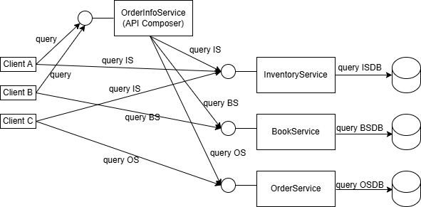
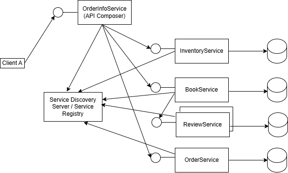

# Patterns for Microservices 
[Data and Communication Patterns for Microservices](https://thorben-janssen.com)

### Database per service
It is recommended that each microservice have its own database (Database per service).  
To simplify, we will have a single database. Each microservice has a database schema that’s private to that service (Schema per service).

### API Composition - branch

OrderInfo apeleaza microserviciile  Book, Inventory, Order.  
Se utilizeaza libraria Open Feign.  

- http://localhost:6060/api/v1/books/1
- http://localhost:7070/api/v1/orders/1
- http://localhost:8080/api/v1/inventories/book/1
- http://localhost:9090/api/v1/orderinfo/1

### Circuit Breaker - branch

OrderInfo apeleaza microserviciile Book, Inventory, Order.  
Book apeleaza microserviciul Review.  
Se utilizeaza librariile Open Feign si Resilience4J.   

- http://localhost:5050/api/v1/reviews/book/1
- http://localhost:6060/api/v1/books/
- http://localhost:7070/api/v1/orders/1
- http://localhost:8080/api/v1/inventories/book/1
- http://localhost:9090/api/v1/orderinfo/1

### Service Discovery Pattern - branch

Implementarea Client-Side Service Discovery   
Se utilizeaza Apache ZooKeeper in rol de "Service Discovery Server / Service Registry"  
Două instanțe ale aceluiași microserviciu Review: una lentă și una rapidă. Microserviciul Book le accesează folosind un Load Balancer  

- http://localhost:5050/api/v1/reviews/book/1
- http://localhost:5051/api/v1/reviews/book/1
- http://localhost:6060/api/v1/books/
- http://localhost:7070/api/v1/orders/1
- http://localhost:8080/api/v1/inventories/book/1
- http://localhost:9090/api/v1/orderinfo/1

### View Databases Pattern - branch

Implementare View Databases Pattern pentru microserviciul OrderInfo
Implementare Outbox Pattern pentru microserviciul Order
{"customerName":"Pavel Dan Gabriel","amount":11.56,"state":0,"positions":[{"idBook":2,"quantity":5}]}